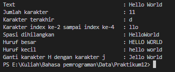
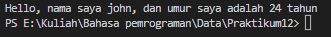

# Tugas Praktikum 12

<b>Nama : Baihaqi Asa'ari Lubis</b>

<b>NIM : 312210720</b>

<b>Prodi : Teknik Informatika</b>

<b>Mata Kuliah : Bahasa Pemrograman</b>

### Latihan 1

Pada latihan 1 kita akan membuat program dengan syarat berikut:
* `txt = 'Hello World'`
* Hitung jumlah karakter
* Ambil karakter terakhir
* Ambil karakter indek ke-2 sampai index ke-4 (llo)
* Hilangkan spasi pada text tersebut (HelloWorld)
* Ubah text menjadi huruf besar
* Ubah text menjadi huruf kecil
* Ganti karakter H dengan karakter J

### Program
```python
txt = 'Hello World'
hitung = len(txt)
terakhir = txt[-1]
index = txt[2:5]
hapus = txt.replace(' ', '')
besar = txt.upper()
kecil = txt.lower()
ganti = txt.replace('H', 'J')

print("Text \t\t\t\t\t: "+txt)
print("Jumlah karakter \t\t\t:",hitung)
print("Karakter terakhir \t\t\t: "+terakhir)
print("Karakter index ke-2 sampai index ke-4 \t: "+index)
print("Spasi dihilangkan \t\t\t: "+hapus)
print("Huruf besar \t\t\t\t: "+besar)
print("Huruf kecil \t\t\t\t: "+kecil)
print("Ganti karakter H dengan karakter j \t: "+ganti)
```

### Hasil Output


### latihan 2

Pada latihan 2 kita akan melanjutkan program berikut:
```python
umur = 24
txt = 'Hello, nama saya john, dan umur saya adalah .... tahun'

print(txt.format(umur))
```

### Program
```python
umur = 24
txt = 'Hello, nama saya john, dan umur saya adalah {} tahun'

print(txt.format(umur))
```
### Hasil Output

