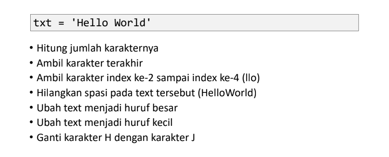

# Tugas Praktikum 12

<b>Nama : Baihaqi Asa'ari Lubis</b>

<b>NIM : 312210720</b>

<b>Prodi : Teknik Informatika</b>

<b>Mata Kuliah : Bahasa Pemrograman</b>

### Latihan 1



- Untuk menghitung jumlah karakter maka kita menggunakan fungsi len()
``` python
# Menghitung jumlah karakter
print ("Jumlah karakter :", len(txt))
```

- Cara mengambil satu karakter pada string yaitu dengan menggunakan kurung siku [ ] dan deklarasi nomor di dalam kurung siku dengan urutan ARRAY dan menggunakan titik dua lalu masukan nomor ARRAY selanjutnya. Untuk mengambil karakter terakhir, gunakan index [-1]. Sedangkan untuk mengambil karakter index ke-2 sampai ke-4, gunakan index [2:5].
``` python
# Mengambil karakter terakhir
print ("Karakter terakhir :", txt[10])
# Mengambil karakter indeks ke-2 sampai indeks ke-4
print ("Karakter indeks ke-2 sampai ke-4 :", txt[2:5])
```

- Jika ingin menghilangkan spasi pada string, gunakan method replace(). Method replace() mengganti semua kemunculan string lama dengan yang baru atau paling banyak kemunculan
- Di dalam method replace, kita dapat menggunakan 2 cara, yang pertama bisa menggunakan (txt.replace(" ", "")) dan kedua dengan cara (txt.replace(txt[5], "")).
``` python
# Menghilangkan spasi
print ("Hilangkan spasi :", txt.replace(" " , ""))
```

- Untuk mengubah huruf menjadi besar, gunakan method upper(),,
Sedangkan jika ingin mengubah huruf menjadi kecil, gunakan method lower()
``` python
# Mengubah teks menjadi huruf besar
print ("Ubah teks menjadi huruf besar :", txt.upper())
# Mengubah teks menjadi huruf kecil
print ("Ubah teks menjadi huruf kecil :", txt.lower())
```

- Untuk mengganti karakter 'H' dengan karakter 'J', gunakan method replace().
``` python
# Mengganti karakter
print ("Ganti karakter H menjadi karakter J :", txt.replace('H','J' ))
```

### Latihan 2


- Untuk memasukkan variable ke dalam string, tambahkan kurung kurawal {} untuk menempatkan variable sebelumnya.
``` python
# Melengkapi kode
umur = 24
text = 'Hello nama saya john, dan umur saya adalah {} tahun '
print (text.format(umur))
```

### Output Latihan 1 dan 2

